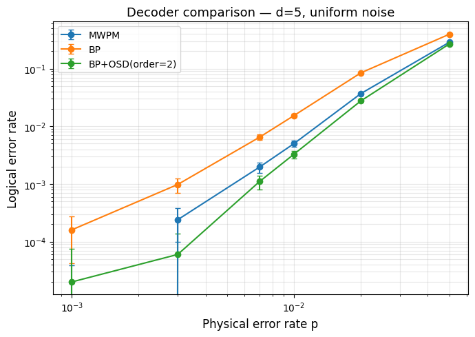
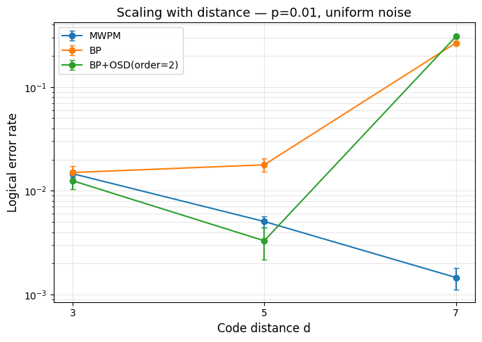

# Surface Code Decoding Benchmark

Simulation and benchmarking of quantum error correction decoders
for the rotated surface code using [stim](https://github.com/quantumstuff/stim)
and multiple decoding algorithms.

## Results

### Decoder comparison at d=5 (uniform noise)



MWPM outperforms pure BP across all noise levels. BP+OSD recovers
near-MWPM performance at the cost of higher computational overhead.

### Scaling with code distance at p=0.01




The most physically revealing plot: MWPM logical error rate decreases
with distance (correct behavior below threshold), while BP *increases*
with distance — a direct demonstration of BP's fundamental failure mode
on surface codes.

---

## Background

### The surface code

The rotated surface code encodes one logical qubit in d² physical data qubits
and d²−1 ancilla qubits. Logical error rate suppression scales as (p/p_th)^((d+1)/2)
below the threshold p_th ≈ 1% for depolarizing circuit-level noise.

The threshold is a phase transition: below p_th, errors form short loops in
space-time and can be corrected; above p_th, they percolate through the code.
Decoding is the problem of identifying which errors occurred given a syndrome
(the set of stabilizer measurement outcomes that flipped).

### Noise model

All experiments use uniform circuit-level depolarizing noise:
- Data qubit depolarization before each syndrome extraction round
- Measurement bit-flip errors on ancilla outcomes  
- Reset errors after qubit initialization

This is the standard benchmark model (Fowler et al. 2012).

---

## Decoders

### MWPM — Minimum Weight Perfect Matching

The standard decoder for surface codes. Solves the decoding problem as a
minimum-weight perfect matching on the detector error model graph. Finds the
globally optimal correction.

- Implementation: [pymatching](https://github.com/oscarhiggott/PyMatching)
- Threshold: ~1.0% (depolarizing circuit-level noise)
- Complexity: near-linear in practice via sparse blossom algorithm

### BP — Belief Propagation

The standard decoder for classical LDPC codes (used in e.g. 5G).
Passes probability messages along the Tanner graph edges until convergence.

**Fundamental limitation on surface codes**: the Tanner graph contains many
short 4-cycles (each data qubit touches 2 X and 2 Z stabilizers). BP assumes
a locally tree-like graph; short cycles violate this assumption and cause BP
to fail to converge or converge to wrong solutions.

This is not an implementation bug — it is a known theoretical limitation.
The scaling plot shows this directly: BP logical error rate *increases* with
code distance at p=0.01, meaning larger codes perform worse. This is the
opposite of what a working QEC decoder should do.

- Implementation: [ldpc](https://github.com/quantumgizmos/ldpc) (BpDecoder)
- Threshold: ~0.3–0.5% (well below MWPM)

### BP+OSD — Belief Propagation + Ordered Statistics Decoding

OSD is a post-processing step that rescues BP when it fails to converge.
After BP, OSD performs a Gaussian elimination on the most reliable bits and
searches for the most likely correction via column sweeping.

At d=5, BP+OSD achieves near-MWPM performance. At d=7, even OSD cannot
fully compensate for the density of short cycles — logical error rate
increases with distance, though more slowly than pure BP.

- Implementation: [ldpc](https://github.com/quantumgizmos/ldpc) (BpOsdDecoder, osd_order=2)
- Threshold: ~0.9–1.0% at moderate distances

---

## Project structure

```
qec_surface/
├── circuits/
│   └── surface_code.py      # Circuit generation and noise models
├── decoders/
│   ├── base.py              # Abstract BaseDecoder interface
│   ├── mwpm.py              # MWPM via pymatching
│   └── belief_propagation.py # BP and BP+OSD via ldpc
├── benchmark/
│   └── logical_error_rate.py # Sampling, statistics, sweep utilities
└── notebooks/
    └── 01_pipeline_demo.ipynb # Experiments and plots
```

### Adding a new decoder

Any new decoder only needs to inherit `BaseDecoder` and implement two methods:

```python
from qec_surface.decoders.base import BaseDecoder
import stim, numpy as np

class MyDecoder(BaseDecoder):
    def _build(self, dem: stim.DetectorErrorModel) -> None:
        # Build internal structure from DEM once at initialization
        ...

    def decode_batch(self, detectors: np.ndarray) -> np.ndarray:
        # Input:  (n_samples, n_detectors) bool array
        # Output: (n_samples, n_observables) bool array
        ...
```

The decoder is then immediately usable with all benchmark utilities:

```python
from qec_surface.benchmark import sweep_noise_levels
df = sweep_noise_levels(distances=[3, 5, 7], noise_levels=[...],
                        decoder_cls=MyDecoder, n_samples=10_000)
```

---

## Statistical treatment

Logical error rates are reported with 95% Wilson score confidence intervals.
The Wilson interval is used instead of the naive binomial interval because it
remains well-behaved for small error counts (does not produce negative bounds).

---

## Installation

```bash
git clone <repo>
cd surface_code_decoders
python -m venv .venv
.venv\Scripts\activate       # Windows
# source .venv/bin/activate  # macOS/Linux
pip install -r requirements.txt
```

## References

- Fowler et al. (2012). Surface codes: Towards practical large-scale quantum computation. [arXiv:1208.0928](https://arxiv.org/abs/1208.0928)
- Dennis et al. (2002). Topological quantum memory. [arXiv:quant-ph/0110143](https://arxiv.org/abs/quant-ph/0110143)
- Panteleev & Kalachev (2021). Degenerate Quantum LDPC Codes With Good Finite Length Performance. [arXiv:2103.06309](https://arxiv.org/abs/2103.06309)
- Roffe et al. (2020). Decoding across the quantum low-density parity-check code landscape. [arXiv:2005.07016](https://arxiv.org/abs/2005.07016)
- Gidney (2021). Stim: a fast stabilizer circuit simulator. [arXiv:2103.02202](https://arxiv.org/abs/2103.02202)
